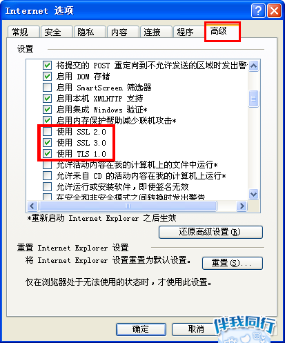

###
**对百度云盘出现网络异常[1]的处理**

　　最近在使用百度云盘客户端时，出现了网络异常[1]的情况，而登陆网页版却是正常登陆的，但是百度方面为了推广其客户端，一些容量较大的文件无法在网页版下载，且只能逐个进行下载，耽误工作进度。查阅网上的大多数帖子，都是无济于事。最终找到了适用于我的解决方案，在此进行分享：

本人系统：**Windows XP Professional SP3**

首先，请尝试在IE浏览器里面打开如下链接：

https://pan.baidu.com
 

　　①如无法打开，请按照以下描述进行操作：
　　　
  　在IE浏览器下单击“工具” ---> “Internet选项”，如下图1所示。
   
   
   

   
图1

   
   在弹出的对话框中选择“高级”，其中**SSL 3.0**和**TLS 1.0**必须勾选，**SSL 2.0**不要勾选，如下图2所示。
   
   
   

   
图2

若依然无法登录，请重新安装IE浏览器，并按照以上链接操作指示进行设置； 

　　②如可以打开，请将以下链接

http://pan.baidu.com/s/1ge4QfLL

内的两个文件存放至百度网盘的安装目录下，并重新启动百度网盘。此时便可以正常登录了。

**P.S.该补丁是否能解决其它Windows系统的登陆问题，暂时不是很清楚。**
